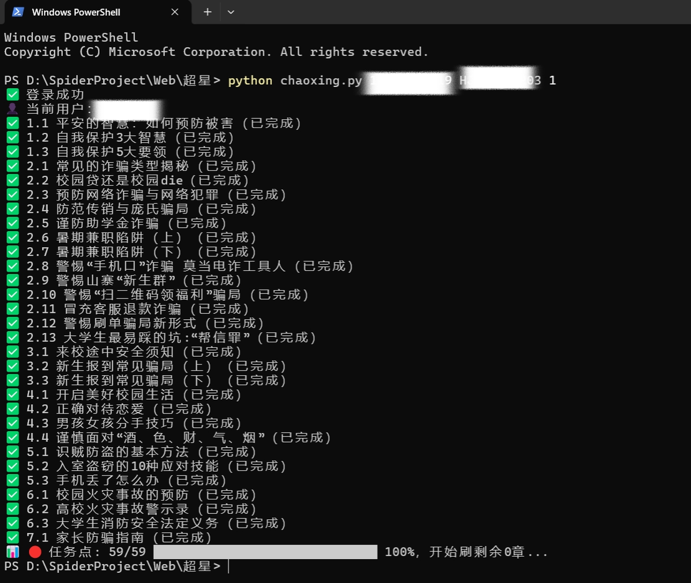

# 超星学习通纯协议自动刷课答题考试

如果不会改代码那么看下面的操作流程和解释即可

**操作流程**：下载代码后，进入下载的文件夹内，然后右键在终端打开（总之终端路径在这个文件夹内即可），然后运行命令（在此之前需配置了python环境）
1. pip install requests pycryptodome beautifulsoup4 numpy fonttools pillow ddddocr
2. python chaoxing.py 账号名 密码 ls
3. python chaoxing.py 账号名 密码 第几个课程

**解释**：第一个命令用于下载代码需要的依赖，第二个命令用来打印所有课程，在前方会有对应的序号，然后记住你要刷的那个课程对应的序号运行第三个命令（第几个课程就是对应那个序号）

**如果有帮助麻烦给个star🙏**

**常见问题：**    courseType = soup.select_one('#myLearn').get('coursetype')
                 ^^^^^^^^^^^^^^^^^^^^^^^^^^^^^^^
AttributeError: 'NoneType' object has no attribute 'get'
如果出现类似报错大概率是因为你超星的左边侧边栏写的不是课程或者结构不太一样

如若遇到问题或者代码逻辑错误，可以加好友询问


**说明**：脚本内置大模型自动答题。视频/图文/测验/考试全部自动处理，**客观题（单选/多选/判断）由大模型作答，简答/填空类主观题一律不作答、留空直接交卷**（详见下面「答题策略」）。默认提交一次即收工不追求满分，命令行是刷全部的逻辑，如果考试已经考过，或者只需要刷考试需见下方详情

**示例图**

如果前面有未开课的那么对应就不一样，可以调用ls命令来看真实index




**了解详情请看下面**

纯协议刷课脚本，无浏览器、无 Selenium。支持登录、课程列表、章节任务扫描、视频挂机、
图文完成、章节测验 LLM 自动答题，内置风控自动过码与字体反爬自动解码。

> 仅供学习交流，请勿用于商业用途或大规模使用，账号风险自负。

## 功能特性

- **登录**：账号密码加密，登录后自动抓取用户昵称
- **课程列表**：`ChaoXing.courses()` 一键列出账号下全部课程，行首序号即课程 index
- **零请求扫描**：一次请求列出全部章节的待完成任务点数和课程总进度，实时进度条随任务完成即时刷新
- **视频刷课**：按 1 倍速真实时间挂机
- **图文完成**：图文任务自动完成
- **章节测验**：客观题 LLM 自动答题；简答/填空类主观题留空直接交卷，不阻塞流程
- **考试**：自动作答、自动交卷、不满分自动重考刷分
- **风控自愈**：触发 9010 验证码风控时自动识别过码，无需人工干预
- **网络自愈**：长挂机心跳撞上被回收的 keep-alive 连接自动重发，单章节异常不中断整体流程

## 环境准备

```text
pip install requests pycryptodome beautifulsoup4 numpy fonttools pillow ddddocr
```

- 字形比对基准字体（思源黑体 CN Normal）：不随仓库分发，首次运行时自动从 jsdelivr 下载
- `cxsecret_map.json`：字体映射缓存，首次运行自动生成，后续自动积累新字
- `错题报告/`：满分模式失败的错题报告输出目录，自动创建
- `考试答题日志/`：考试答题日志输出目录，自动创建

## 使用方法

**命令行**

```bash
# 刷课：自动刷视频/图文/测验，最后自动处理待做考试
python chaoxing.py <用户名> <密码> <课程序号index>

# 查看账号下全部课程（行首序号即 index，指定刷哪门课时直接抄）
python chaoxing.py <用户名> <密码> ls
```

**Python 调用**

```python
from chaoxing import ChaoXing

ChaoXing.courses('账号', '密码')                        # 列出全部课程
ChaoXing.progress('账号', '密码', 1)                    # 列出章节名列表（快速看结构）
ChaoXing.progress('账号', '密码', 1, True)              # 带任务点进度、考试列表的详细版
ChaoXing.main('账号', '密码', 1)                        # 全流程刷课
ChaoXing.main('账号', '密码', 1, mode='course')         # 只刷课程内容，不碰考试
ChaoXing.main('账号', '密码', 1, full_score=True)       # 测验争取满分
```

**main() 参数详解**

| 参数 | 类型 | 默认值 | 说明 |
|------|------|--------|------|
| `username` / `password` | str | 必填 | 登录账号和密码 |
| `index` | int | 必填 | 第几个课程（从 1 开始），和 `courses()` 输出的行首序号一一对应 |
| `chapter_id` | int/str | None | 只刷指定章节；None = 整门课。章节 id 看 `progress()` 输出行首方括号里的数字，如 `[1240678458]` |
| `mode` | str | `'all'` | 刷什么，五选一，见下表 |
| `exam_id` | int/str | None | 只在 `mode='exam'` 时生效。传了只做这一场考试；不传则把该课程所有「待做」和「不满分」的考试全部做一遍（不满分自动走重考入口刷分） |
| `full_score` | bool | False | 测验满分模式，见「答题策略」。False：客观题答完提交一次即收工；True：客观题未全对自动重做，最多 3 轮争取满分 |
| `show_prompt` | bool | False | True 时每道题都打印发给大模型的完整提示词，用于调试或围观模型怎么答题（测验/考试都生效） |
| `save_log` | bool | False | True 时保存考试答题日志到 `考试答题日志/`。**只有没考满分（含批阅中未出分）的场次才落盘**，满分直接丢弃——日志用于复盘错题，满分没有复盘价值；每轮重考独立存档不覆盖 |
| `no_submit` | bool | False | True 时考试只作答保存、**不自动交卷**：答案留在服务端，你可以登录网页自己检查后手动交。 |

`mode` 五种模式：

| mode | 刷什么 |
|------|--------|
| `'all'`（默认） | 视频 + 图文 + 测验 + 待做考试，全流程 |
| `'course'` | 只刷课程内容：视频 + 图文 + 测验，不碰考试 |
| `'watch'` | 只刷视频和图文（测验/考试都不碰） |
| `'test'` | 只刷章节测验（视频/图文/考试都不碰） |
| `'exam'` | 只跑考试，配合 `exam_id` 使用（见上表） |

**progress() / courses()**

- `courses(username, password)`：列出账号下全部课程，行首序号即 `main()` 的 index；同时返回 `[(序号, 课程名), ...]` 供代码内使用
- `progress(username, password, index)`：默认只列章节名列表（快速看课程结构）；传 `show_detail=True` 输出章节完成状态、任务点总进度和考试列表（`main()` 开头固定用这种详细输出），像[xxxxxx]这个里面是关于章节/考试id可传参给main用于单独刷

## 答题策略

**客观题（单选 / 多选 / 判断）：大模型自动作答**

脚本把题干和选项喂给内置大模型选答案，多选题提交前自动按字母排序（与服务端规则一致）。

**主观题（简答 / 填空类）：一律不作答，留空直接交卷**

脚本不答主观题——答案留空，但提交参数完整（所有题号都在），所以提交不会报错，直接交卷等老师批阅。两种常见情况都能正常走完：

- 测验里夹着几道简答题：客观题答完 → 简答题留空 → 一次性提交，本轮收工
- 整份测验全是简答题：同样直接提交空卷，不会因为没有可答的题而卡住报错

简答题批阅前谁也不知道对错，所以它不参与满分判定，也不落盘错题报告。

**默认：不追求满分（full_score=False）**

客观题答完就提交，一次收工，不生成错题报告。做完觉得分不够高，传 `full_score=True` 重跑即可（取最高成绩规则，重做不亏）。

**满分模式（full_score=True）**

提交后判分，只要客观题有错就自动重做再答，最多 3 轮争取全对；3 轮后仍未全对，把错题写入 `错题报告/用户名_章节名_测试.txt` 供人工复盘。

**进度显示**

- 每完成一个任务点（视频看完 / 图文完成 / 测验提交）立即刷新总进度条
- 简答题测验提交后要等老师批阅，批阅落地前服务端可能暂不计该任务点完成；进度条只增不减，不会倒退

## 常见问题

- **视频要等多久？** 按视频真实时长挂机（服务端会复核观看时长，快进会被回滚），挂机等待即可。
- **测验里的简答题怎么办？** 不答，留空直接交卷等老师批阅，详见「答题策略」。
- **错题报告什么时候生成？** 仅在 `full_score=True` 且 3 轮重做后客观题仍未全对时写入；默认模式提交即收工，不落盘报告。
- **考试日志什么时候生成？** `save_log=True` 且该场没考满分（或批阅中未出分）时写入 `考试答题日志/`。
- **触发验证码风控怎么办？** 脚本自动识别并提交验证码后继续，无需人工处理。
- **模型返回 403？** 当前 LLM 账户无该模型额度，换 `flash` 系列模型或更换 API Key。

## 文件结构

```text
超星/
├── chaoxing.py          # 主脚本
├── img/                 # README 示例图
├── cxsecret_map.json    # 字体映射缓存（运行时生成）
├── 错题报告/            # 满分模式失败的错题报告（运行时生成）
└── 考试答题日志/        # 考试答题日志（运行时生成）
```

## 免责声明

本项目仅供技术学习与交流，请勿用于任何商业或非法用途。使用本脚本产生的一切后果由使用者自行承担。
